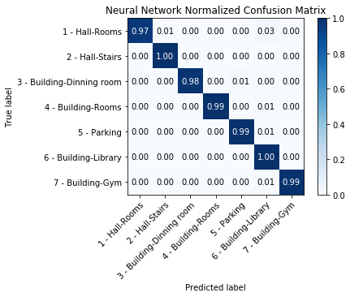

# Landmark-Recognition-with-Keras

## The Neural Network
99% accuracy on validation (static tests)

91% accuracy on test (dynamic tests)

Classification error = 1%

Test error = 9%



These are very good results and that is why I have decided to end the training of the network here after 90 epochs and with the training of around ~40.000 images.

It is possible that I publish other projects in the future expanding, with other state-of-the-art 
techniques (I even have a future project with bounding boxes in mind), what has been done in this project.

## Repository organization
##### data
In the data folder you can find all the images i used to train the Neural Network:
	- Training Images
	- Validation Images
	- Test

In the "test" folder you can watch the videos where i show the Neural Network working.

##### resources
Resources for this readme, nothing important, the confusion matrix only.

##### Dataset Refinement.ipynb
All the code used to process and modify the original images is in this notebook.

##### Dynamic Test.ipynb
All the code used to read a video and test the neural network on it is in this notebook.

##### Neural Network for Desktop.ipynb and Neural Network for Google Colab.ipynb
In these notebooks there are all the code used to train the CNN and you can select where you can execute then; in your computer or in google colab.

In both you can execute the static tests (validation).

##### neural_network.h5
You have a .h5 file with the last CNN trained. You can load it with Keras as is shown in the Jupyter Notebooks in this way:
```
from keras.models import load_model
model = load_model(path + 'neural_network.h5')
```

## Why this project? Time to tell a story...
Well, I m finishing my master degree in Artificial Inteligent in the "Universidad Politecnica de Madrid" 
[MUIA](http://www.dia.fi.upm.es/masteria/?q=es/MUIA) and i will present this Neural Network as my final proyect in June.
I have always liked robots, and in the master degree i had a robots assignature where i had a project 
with visual landmarks, classifying photos with a K-NN. 
As i am living in a student residence while i study in Madrid i thought 
"Ey Amable, why don't you take photos from the residence and train a CNN to 
identify every important point of the residence? It could be fun! It's like the robot assignature project" 
I proposed it to one of my teachers and that is how i have end up doing this proyect.

## Contributing
Please, open an issue to discuss what you would like to change.

If you read any bad translation in documentation or code send me an email with the correct sentences.

If you believe that some part could be better explained send me an email with your questions.

Thanks for read me! (^.^)